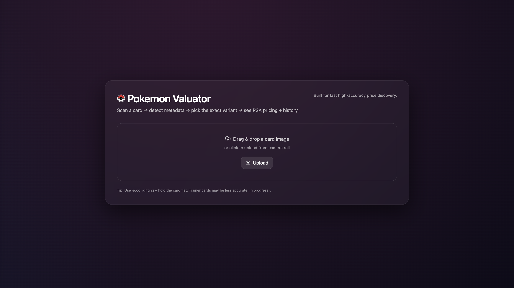
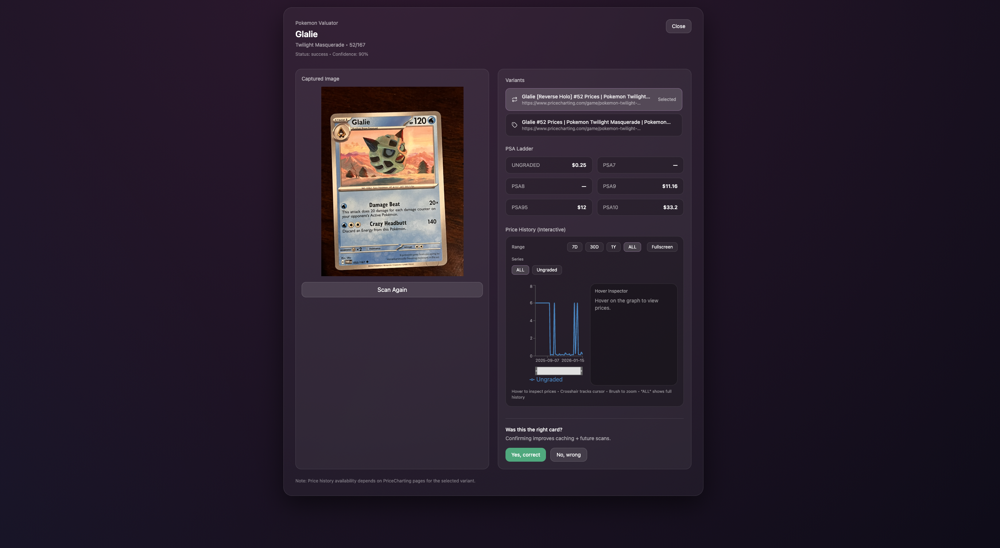

# 🎴 Pokémon Card Valuator

Pokémon Card Valuator is a fast, modern web app that turns a card photo into:

- **Card identification** (name, set, card number)
- **Variant selection** (choose the exact match from multiple printings)
- **Market pricing** (Ungraded + PSA ladder when available)
- **Interactive price history** (hover + fullscreen chart per grade)

It’s designed to feel like a real consumer product: clean UI, instant feedback, and a smooth scanning-to-results experience.

---

## ▶️ Demo Video

📺 **Watch the full demo here (Unlisted YouTube):**  
**[https://youtube.com/demo-link](https://youtu.be/z_X_pR68-K0)**

---

## 🌐 Live Frontend Demo (GitHub Pages)

✅ GitHub Pages hosts the **frontend only** (UI demo).  
⚠️ Uploading a photo from GitHub Pages will fail unless you run the backend locally.

Frontend demo link:  
**https://akarsh-doki.github.io/pokemon-card-valuator/**

---

## ✨ Features

### ✅ Scan → Identify → Price
Upload a photo and the backend will:
- detect key fields from the card image  
- match the best canonical card candidate  
- retrieve market pricing for variants  

### ✅ Variant Picker
If multiple variants exist, the results page lets you select the exact match.

### ✅ PSA Ladder
When available, shows market pricing for:
- Ungraded
- PSA 7 / 8 / 9 / 9.5 / 10

### ✅ Interactive Price History
Hover to inspect historical pricing and expand into fullscreen mode.

---

## 🧠 How it works

The pipeline combines:
- **Computer vision** to focus OCR on the important regions of the card (name / set / number)
- **Matching logic** to map the scan to the closest real card entry
- **Market integrations** to fetch ungraded + graded pricing and sale history
- **FastAPI + SSE** to stream scan progress to the UI in real-time

---

## ⚠️ Current Limitations

- PSA **grading prediction** (image → predicted grade) is **not implemented yet**
- Price history depends on available public market data for that variant
- Accuracy improves with good lighting, flat card positioning, and minimal glare

---

# ✅ Run Locally (Full Experience)

## 1) Backend (FastAPI)

### Setup environment
```bash
python -m venv .venv
source .venv/bin/activate
pip install -r requirements.txt
```

This repo supports a YOLOv8 region detector to make OCR reliable by cropping only:
- title
- card_number
- set_symbol

## Usage
- Open the frontend
- Upload a Pokémon card image
- Wait for the scan to complete
- Choose the correct variant (if needed)
- View PSA ladder + interactive price history
- Submit feedback (“Yes correct” / “No wrong”) to improve future scans

## Demo




## 👋 Feedback / Improvements
This app is built to be extensible. Some future upgrades:
- add PSA grade prediction from images
- improve trainer card matching accuracy
- add more marketplaces and compare prices
- caching + offline snapshots for faster load times
