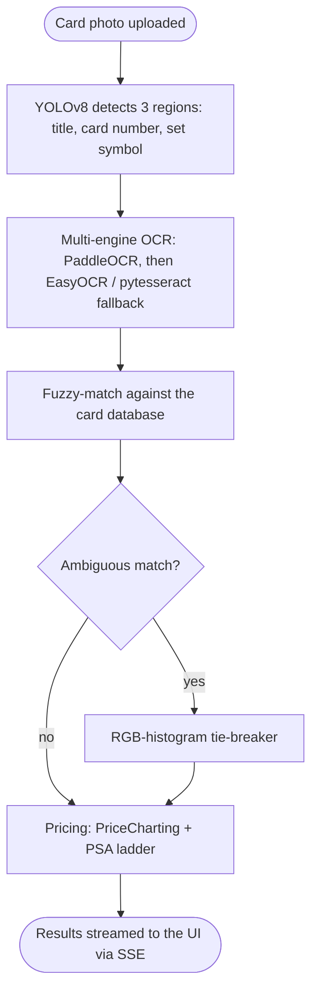

# 🎴 Pokémon Card Valuator

Pokémon Card Valuator is a fast, modern web app that turns a card photo into:

- **Card identification** (name, set, card number)
- **Variant selection** (choose the exact match from multiple printings)
- **Market pricing** (Ungraded + PSA ladder when available)
- **Interactive price history** (hover + fullscreen chart per grade)

It’s designed to feel like a real consumer product: clean UI, instant feedback, and a smooth scanning-to-results experience.

---

## ▶️ Demo Video

📺 **Watch the full demo here (Unlisted YouTube):**  
**[https://youtube.com/demo-link](https://youtu.be/z_X_pR68-K0)**

---

## 🌐 Live Frontend Demo (GitHub Pages)

✅ GitHub Pages hosts the **frontend only** (UI demo).  
⚠️ Uploading a photo from GitHub Pages will fail unless you run the backend locally.

Frontend demo link:  
**https://akarsh-doki.github.io/pokemon-card-valuator/**

---

## ✨ Features

### ✅ Scan → Identify → Price
Upload a photo and the backend will:
- detect key fields from the card image  
- match the best canonical card candidate  
- retrieve market pricing for variants  

### ✅ Variant Picker
If multiple variants exist, the results page lets you select the exact match.

### ✅ PSA Ladder
When available, shows market pricing for:
- Ungraded
- PSA 7 / 8 / 9 / 9.5 / 10

### ✅ Interactive Price History
Hover to inspect historical pricing and expand into fullscreen mode.

---

## 🧩 Architecture



## 🧠 How it works

1. **Region detection** — a YOLOv8 detector crops the card to three regions (title, card number, set symbol), so OCR never reads the whole noisy photo.
2. **Multi-engine OCR** — PaddleOCR reads each region first, with EasyOCR and pytesseract as fallbacks, so one engine's misread doesn't sink the scan.
3. **Matching** — the OCR text is fuzzy-matched against the card database; when two printings share a name and number, an RGB-colour-histogram comparison breaks the tie.
4. **Pricing** — ungraded + PSA-ladder prices and history are pulled from market integrations (PriceCharting + TCGdex), cached on disk.
5. **Streaming** — FastAPI streams scan progress over SSE, and CPU-bound vision work is offloaded with `run_in_executor` so the server stays responsive.

> **Routing OCR through YOLO region detection lifted field-read accuracy from roughly 30% on the raw photo to about 85%.**

## 🛠 Tech Stack

| Layer | Technology | Why |
| --- | --- | --- |
| **Frontend** | React + TypeScript + Vite + Tailwind + Recharts | Type-safe UI, fast builds, Recharts for the price chart |
| **Backend** | FastAPI, Python | Async, streams scan progress over SSE, auto OpenAPI docs |
| **Region detection** | YOLOv8 (Ultralytics) | Crops title / number / set so OCR runs on clean regions (~30% → ~85%) |
| **OCR** | PaddleOCR (primary), EasyOCR / pytesseract (fallback) | If one engine misreads, another recovers the field |
| **Matching** | Fuzzy text match + RGB-histogram tie-breaker | Disambiguates near-identical printings |
| **Pricing** | PriceCharting + TCGdex | Ungraded + PSA-graded prices and history |
| **Data/model versioning** | DVC | Reproducible data/models without bloating git |
| **Streaming** | Server-Sent Events (SSE) | Real-time scan progress to the UI |

## 🧭 Key Design Decisions

Full reasoning in [DECISIONS.md](DECISIONS.md). The headline calls:

| Decision | Choice | Why |
| --- | --- | --- |
| Raw-photo OCR vs region detection first | **Region detection first** | Full-image OCR was ~30%; cropping to title/number/set pushed it to ~85% |
| One OCR engine vs several | **Multi-engine with fallback** | Fallbacks recover a field when the primary misreads |
| Text match only vs a visual signal | **Text + RGB histogram** | Two printings can share a name/number; colour breaks the tie |
| WebSockets vs SSE | **SSE** | One-way progress; simpler than WebSockets |
| Commit data/models vs DVC | **DVC** | Keeps the repo small and reproducible |

## 🧪 Testing

```bash
pytest -v
```

The suite covers the card-matching logic, OCR field parsing, and the pricing-integration layer. <!-- edit this line to match what's actually in tests/ -->

---

## ⚠️ Current Limitations

- PSA **grading prediction** (image → predicted grade) is **not implemented yet**
- Price history depends on available public market data for that variant
- Accuracy improves with good lighting, flat card positioning, and minimal glare

---

# ✅ Run Locally (Full Experience)
## 1) Backend (FastAPI)
### Setup environment
```bash
python -m venv .venv
source .venv/bin/activate
pip install -r requirements.txt
```
This repo supports a YOLOv8 region detector to make OCR reliable by cropping only:
- title
- card_number
- set_symbol

## Usage
- Open the frontend
- Upload a Pokémon card image
- Wait for the scan to complete
- Choose the correct variant (if needed)
- View PSA ladder + interactive price history
- Submit feedback (“Yes correct” / “No wrong”) to improve future scans

## Demo


## 👋 Feedback / Improvements
This app is built to be extensible. Some future upgrades:
- add PSA grade prediction from images
- improve trainer card matching accuracy
- add more marketplaces and compare prices
- caching + offline snapshots for faster load times
